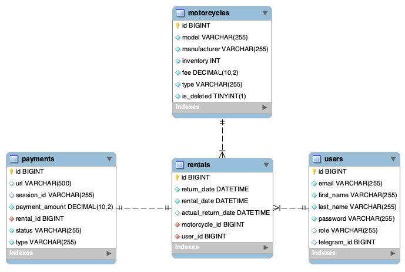

# 2wheels4u

## Project description

2wheels4u is a RESTful web application designed to serve as a motorcycle rental service. 
The project is developed using Spring Boot and Java, adhering strictly to the principles of the 
REST architectural style, thereby ensuring seamless and stateless communication between 
clients and the server.

The application provides users with the ability to register and log in using their credentials. 
Notably, it offers role-based authorization, distinguishing between managers and regular users, 
granting them distinct levels of access and control over the system.

One of the standout features of this service is its integration with the Stripe payment system. 
This integration ensures secure and reliable transactions for users, allowing them to make 
motorcycle rental payments with the utmost convenience and peace of mind.

Furthermore, the application incorporates a notification feature through a Telegram bot. 
This innovative feature allows both users (managers and customers) to swiftly receive real-time 
updates and information regarding the status of their rentals, payment notifications, and any 
changes in the condition of the motorcycles.

## Table of Contents

- [Features](#features)
- [Technologies used](#technologies)
- [Project structure](#project-structure)
- [Database diagram](#database-diagram)
- [Technical details](#technical-details)
- [Getting Started](#getting-started)

## Features
- Register and log in as a customer/manager.

#### Registered as CUSTOMER role:
- Find all motorcycles with their characteristics.
- Find page of motorcycles with sorting.
- Find motorcycle by id.
- Create payment session.
- Get your payments.
- Create rental.
- Get your rentals.
- Get your info.
- Update your info.
#### Registered as MANAGER role:
- Create motorcycle.
- Update motorcycle.
- Add motorcycle to inventory.
- Remove motorcycle from inventory.
- Delete motorcycle.
- Find motorcycle by id.
- Find all motorcycles with their characteristics.
- Find page of motorcycles with sorting.
- Create payment session.
- Find payments by user id.
- Find rental by id.
- Find rentals by user id and status.
- Create rental.
- Return motorcycle for rental (CUSTOMER cannot do it because price will depend on this event).
- Get your info.
- Update your info.
- Update user's role.

> Two users have already present in the database. Manager has login: manager@mail.com, 
> password: 123Admin. Customer - login: user@mail.com, password: 1234User

## Technologies
- Java 17
- Spring Boot 3.1.0
- Springdoc OpenAPI (Swagger) 2.1.0
- Liquibase
- MySQL 5.7
- Lombok TBD
- Stripe Java 22.21.0
- Jjwt 0.9.1
- Telegram Bots 6.5.0
- Docker 23.0.5
- Apache Maven 3.8.7
- REST-assured
- Testcontainers

## Project structure
The project has a Three-Tier Architecture:

| Layer                                  | Responsibilities                                                  | 
|----------------------------------------|-------------------------------------------------------------------|
| **Presentation layer (Controllers)**   | Accepts requests from clients and send response.                  |
| **Application logic layer (Services)** | Provide logic to operate on the data from the DB and the client.  |
| **Data access layer (Repositories)**   | Represents a connection between the database and the application. |

## Database diagram

## Technical details
* DTOs represent communication between presentation and logic layers.
* DTO mappers convert DTOs to entities and vice versa.
* Application uses telegram bot for notify manager or user about different events.
* The Stripe library can create a payment session and payment URL, which users can use for payment.
* BCryptPasswordEncoder is used for password encryption.
* Hibernate annotations are used for field validation along with custom annotations.
* Jackson API is responsible for converting objects to JSON.
* Config package contains classes allow to configure Spring Security, Swagger and telegram bot.
* Security package contains class, allows to create UserDetails which store user information.
* JWT make this application stateless.

## Getting Started
#### To get started with the project, follow these steps:

##### For local run
- Clone the repository from [here](https://github.com/Vitaliistf/2wheels4u.git);
- Get a token to create a Telegram bot from [here](https://t.me/BotFather);
- Get stripe secret api key from [website](https://stripe.com/);
- Set your credentials in [application.properties](src/main/resources/application.properties);
- Set your credentials for tests in [application.properties](src/test/resources/application.properties);
  > if you want to run tests, you should run docker before this.
- Build the project: `mvn clean package`;
- Press `run`;

#### For run as docker container:
- Ensure that you have Docker installed and running;
- Clone the repository from [here](https://github.com/Vitaliistf/2wheels4u.git);
- Get a token to create a Telegram bot from [here](https://t.me/BotFather);
- Get stripe secret api key from [website](https://stripe.com/);
- Set up the necessary environment variables (refer to [.env](.env) for the required variables);
- Set your credentials in [application.properties](src/main/resources/application.properties);
- Set your credentials for tests in [application.properties](src/test/resources/application.properties);
- Build the project: `mvn clean package`;
- Run the command: `docker-compose up`;

> You can test the application using Swagger by accessing http://localhost:8080/swagger-ui/index.html.
>
> Also, you can use postman collection defined in the [file](postman/2wheels4u.postman_collection.json)
  or by this [link](https://www.postman.com/orbital-module-technologist-20121380/workspace/public-projects/collection/26104168-3212e435-3c2c-4b2d-b29e-348a6788eeb7?action=share&creator=26104168).
